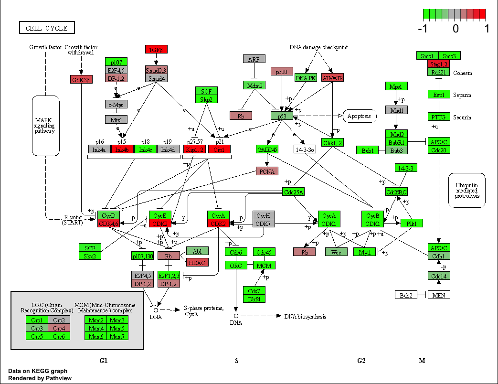

# Project Outline

1. Data Import
2. PCA
3. DESeq Analysis
4. Volcano Plot
5. Annotation
6. Pathway Analysis

## 1. Data Import

```{r}
metaFile <- "GSE37704_metadata.csv"
countFile <- "GSE37704_featurecounts.csv"

#Import and view metadata
colData = read.csv(metaFile, row.names=1)
head(colData)

#Import and view countdata
countData = read.csv(countFile, row.names=1)
head(countData)

# Note we need to remove the odd first $length col
countData <- as.matrix(countData[,-1])
head(countData)
```

Next, let's remove rows that are all zeros.

```{r}
#Find empty rows
zero.rows <- which(rowSums(countData)==0)
#Remove empty rows and check that it worked
countData.filtered <- countData[-zero.rows,]
head(countData.filtered)
#How many genes are left?
nrow(countData.filtered)
```

## PCA

Let's check that the treated and controls cluster separately.

```{r}
#Generate PCA
countPCA <- prcomp(t(countData.filtered))
#Plot PCA colored by condition (knockdown or not)
plot(countPCA$x, pch=16, col=as.factor(colData$condition))
text(countPCA$x, labels=colData$condition)
```

Hooray! The clustering looks correct!

## DESeq Analysis

```{r}
library(DESeq2)

#Run DESeq
dds = DESeqDataSetFromMatrix(countData=countData.filtered,
                             colData=colData,
                             design=~condition)
dds = DESeq(dds)
```

```{r}
#View dds and get results
dds
res = results(dds)
head(res)
summary(res)
```

## Volcano plot

```{r}
#Preliminary (i.e. boring) volcano plot
plot(res$log2FoldChange, -log(res$padj))
```

Let's improve the plot to make it more informative.
```{r}
#Make a  baseline color vector for all genes (will replace gray with actual color later)
mycols <- rep("gray", nrow(res))

#Color red the genes with absolute fold change above 2
mycols[abs(res$log2FoldChange) > 2] <- "red"

#Color blue those with adjusted p-value less than 0.01
#and absolute fold change more than 2
inds <- (res$padj < 0.01) & (abs(res$log2FoldChange) > 2 )
mycols[inds] <- "blue"

plot(res$log2FoldChange, -log(res$padj), col=mycols, xlab="Log2(FoldChange)", ylab="-Log(P-value)" )
```

## Annotation

```{r}
library("AnnotationDbi")
library("org.Hs.eg.db")

columns(org.Hs.eg.db)

res$symbol = mapIds(org.Hs.eg.db,
                    keys=row.names(res), 
                    keytype="ENSEMBL",
                    column="SYMBOL",
                    multiVals="first")

res$entrez = mapIds(org.Hs.eg.db,
                    keys=row.names(res),
                    keytype="ENSEMBL",
                    column="ENTREZID",
                    multiVals="first")

res$name =   mapIds(org.Hs.eg.db,
                    keys=row.names(res),
                    keytype="ENSEMBL",
                    column="GENENAME",
                    multiVals="first")

#Check that the annotations were appended
head(res, 10)
```

Let's save our annotated data.

```{r}
res = res[order(res$padj),]
write.csv(res, file="deseq_results.csv")
```

## Pathway Analysis

```{r}
library(pathview)
library(gage)
library(gageData)

data(kegg.sets.hs)
data(sigmet.idx.hs)

#Focus on signaling and metabolic pathways only
kegg.sets.hs = kegg.sets.hs[sigmet.idx.hs]

#Examine the first 3 pathways
head(kegg.sets.hs, 3)
```

```{r}
#Create a named vector for the gage function
foldchanges = res$log2FoldChange
names(foldchanges) = res$entrez
head(foldchanges)

# Get the results and examine them
keggres = gage(foldchanges, gsets=kegg.sets.hs)
attributes(keggres)

# Look at the first few down (less) pathways
head(keggres$less)
```

Let's create pathway figures.

```{r}
pathview(gene.data=foldchanges, pathway.id="hsa04110")
# A different PDF based output of the same data
pathview(gene.data=foldchanges, pathway.id="hsa04110", kegg.native=FALSE)

## Focus on top 5 upregulated pathways here for demo purposes only
keggrespathways <- rownames(keggres$greater)[1:5]

# Extract the 8 character long IDs part of each string
keggresids = substr(keggrespathways, start=1, stop=8)
keggresids

pathview(gene.data=foldchanges, pathway.id=keggresids, species="hsa")
```

Display images.




