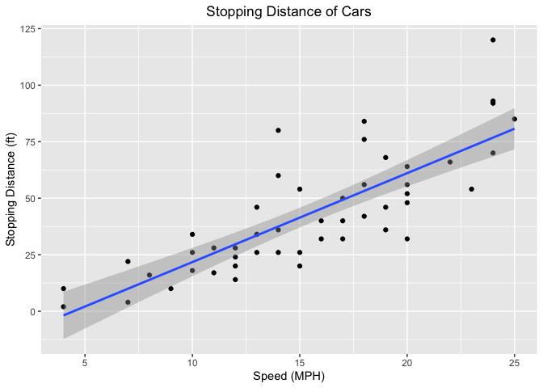
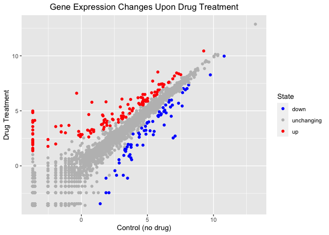
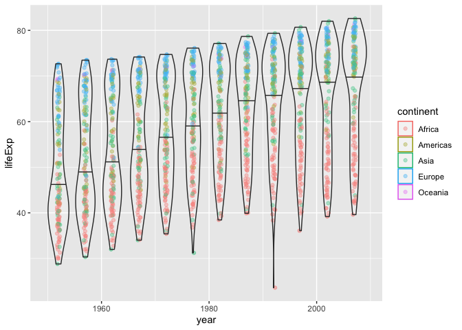

Data Visualization
================
pierceford
2021-12-03

``` r
#Class 05: Data Visualization
#Today we are going to use ggplot2

#Load package
library(ggplot2)

#Use inbuilt "cars" dataset first, confirm content with head function
head(cars)
```

    ##   speed dist
    ## 1     4    2
    ## 2     4   10
    ## 3     7    4
    ## 4     7   22
    ## 5     8   16
    ## 6     9   10

``` r
#All ggplots have at least data + aes + geom layers
ggplot(data=cars) + 
  aes(x=speed, y=dist) + 
  geom_point() +
  geom_smooth(method="lm") +
  theme(plot.title = element_text(hjust = 0.5)) +
  labs(title="Stopping Distance of Cars", x="Speed (MPH)", y="Stopping Distance (ft)")
```

    ## `geom_smooth()` using formula 'y ~ x'

<!-- -->

``` r
#ggplot is not the only graphics system, "base" R has one built in too
plot(cars)
```

<!-- -->

``` r
#Pull in RNA-seq dataset
url <- "https://bioboot.github.io/bimm143_S20/class-material/up_down_expression.txt"
genes <- read.delim(url)
head(genes)
```

    ##         Gene Condition1 Condition2      State
    ## 1      A4GNT -3.6808610 -3.4401355 unchanging
    ## 2       AAAS  4.5479580  4.3864126 unchanging
    ## 3      AASDH  3.7190695  3.4787276 unchanging
    ## 4       AATF  5.0784720  5.0151916 unchanging
    ## 5       AATK  0.4711421  0.5598642 unchanging
    ## 6 AB015752.4 -3.6808610 -3.5921390 unchanging

``` r
#Interrogate features of genes data frame
#Number of genes
nrow(genes)
```

    ## [1] 5196

``` r
#Names and amounts of columns
colnames(genes)
```

    ## [1] "Gene"       "Condition1" "Condition2" "State"

``` r
ncol(genes)
```

    ## [1] 4

``` r
#Pull numbers of downregulated, unchanging, and upregulated genes
table(genes$State)
```

    ## 
    ##       down unchanging         up 
    ##         72       4997        127

``` r
#Calculate % of each state
round((table(genes$State)/nrow(genes))*100, 2)
```

    ## 
    ##       down unchanging         up 
    ##       1.39      96.17       2.44

``` r
#Generate RNA-seq plot
RNA_plot <- ggplot(genes) +
  aes(x=Condition1, y=Condition2, col=State) +
  geom_point()

#Display plot
RNA_plot
```

<!-- -->

``` r
#Adjust colors and add labels
RNA_plot <- RNA_plot + scale_color_manual(values=c("blue", "gray", "red"))
RNA_plot <- RNA_plot + theme(plot.title = element_text(hjust = 0.5)) +
  labs(title="Gene Expression Changes Upon Drug Treatment", 
       x="Control (no drug)", y="Drug Treatment")

#Display new plot
RNA_plot
```

<!-- -->

``` r
#Exploring gapminder dataset
library(gapminder)
head(gapminder)
```

    ## # A tibble: 6 × 6
    ##   country     continent  year lifeExp      pop gdpPercap
    ##   <fct>       <fct>     <int>   <dbl>    <int>     <dbl>
    ## 1 Afghanistan Asia       1952    28.8  8425333      779.
    ## 2 Afghanistan Asia       1957    30.3  9240934      821.
    ## 3 Afghanistan Asia       1962    32.0 10267083      853.
    ## 4 Afghanistan Asia       1967    34.0 11537966      836.
    ## 5 Afghanistan Asia       1972    36.1 13079460      740.
    ## 6 Afghanistan Asia       1977    38.4 14880372      786.

``` r
#Plot year vs life expectancy
ggplot(gapminder) +
  aes(x=year, y=lifeExp, col=continent) +
  geom_jitter(width=0.3, alpha=0.4) +
  geom_violin(aes(group=year), alpha=0.2, draw_quantiles=0.5)
```

<!-- -->

``` r
#Commenting out plotly for PDF render
#Load plotly
#library(plotly)
#ggplotly()
```
