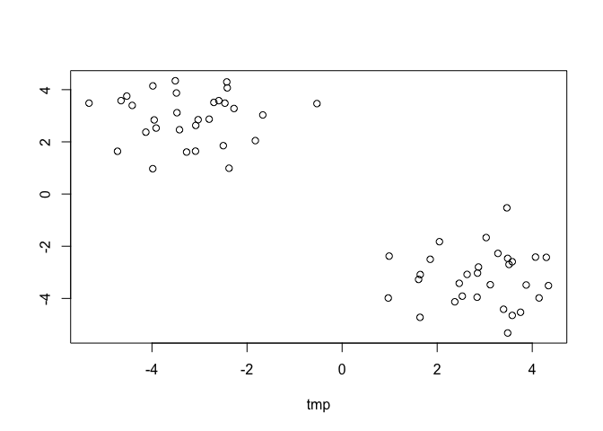
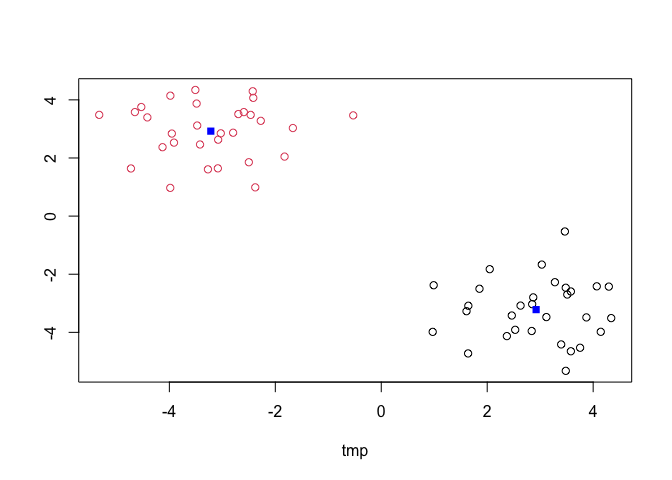
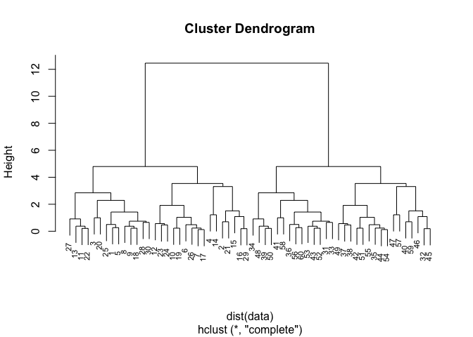
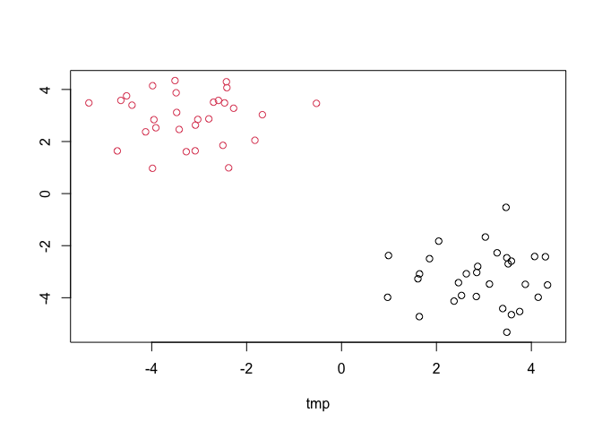
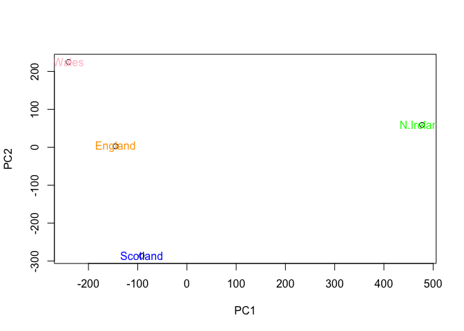

Machine Learning 1
================
Pierce Ford (PID: A59010464)
10/22/2021

#Clustering Methods

Kmeans clustering in R is done with the `kmeans()` function. Here we
make up some data to test and learn with.

``` r
tmp <- c(rnorm(30, 3), rnorm(30, -3))
#Make a two column dataset that includes tmp and tmp reversed, to make two clear
#groups of points
data <- cbind(tmp, rev(tmp))
plot(data)
```

<!-- -->

Run `kmeans()` set k (centers) to 2 and nstart to 20. The thing with
Kmeans is you have to tell it how many clusters you want.

``` r
km <- kmeans(data, centers=2, nstart=20)
km
```

    ## K-means clustering with 2 clusters of sizes 30, 30
    ## 
    ## Cluster means:
    ##         tmp          
    ## 1  2.923339 -3.217687
    ## 2 -3.217687  2.923339
    ## 
    ## Clustering vector:
    ##  [1] 1 1 1 1 1 1 1 1 1 1 1 1 1 1 1 1 1 1 1 1 1 1 1 1 1 1 1 1 1 1 2 2 2 2 2 2 2 2
    ## [39] 2 2 2 2 2 2 2 2 2 2 2 2 2 2 2 2 2 2 2 2 2 2
    ## 
    ## Within cluster sum of squares by cluster:
    ## [1] 57.68627 57.68627
    ##  (between_SS / total_SS =  90.7 %)
    ## 
    ## Available components:
    ## 
    ## [1] "cluster"      "centers"      "totss"        "withinss"     "tot.withinss"
    ## [6] "betweenss"    "size"         "iter"         "ifault"

> Q. How many points are in each cluster?

``` r
km$size
```

    ## [1] 30 30

> Q. What ’component of your result object details cluster
> assignment/membership?

``` r
km$cluster
```

    ##  [1] 1 1 1 1 1 1 1 1 1 1 1 1 1 1 1 1 1 1 1 1 1 1 1 1 1 1 1 1 1 1 2 2 2 2 2 2 2 2
    ## [39] 2 2 2 2 2 2 2 2 2 2 2 2 2 2 2 2 2 2 2 2 2 2

> Q. What ’component of your result object details cluster cluster
> center?

``` r
km$centers
```

    ##         tmp          
    ## 1  2.923339 -3.217687
    ## 2 -3.217687  2.923339

> Q. Plot x colored by the kmeans cluster assignment and add cluster
> centers as blue points?

``` r
plot(data, col=km$cluster)
points(km$centers, col="blue", pch=15)
```

<!-- -->

#Hierarchal Clustering

We will use the `hclust()`function on the same data as before and see
how this method works.

``` r
hc <- hclust(dist(data))
hc
```

    ## 
    ## Call:
    ## hclust(d = dist(data))
    ## 
    ## Cluster method   : complete 
    ## Distance         : euclidean 
    ## Number of objects: 60

Hclust has a plot method

``` r
plot(hc, cex=0.7)
```

<!-- -->

To find our membership vector we need to “cut” the tree and for this we
use the `cutree()` function and tell it the height to cut at.

``` r
cutree(hc, h=7)
```

    ##  [1] 1 1 1 1 1 1 1 1 1 1 1 1 1 1 1 1 1 1 1 1 1 1 1 1 1 1 1 1 1 1 2 2 2 2 2 2 2 2
    ## [39] 2 2 2 2 2 2 2 2 2 2 2 2 2 2 2 2 2 2 2 2 2 2

We can also use `cutree()` and state the number of k cluster we want.

``` r
grps <- cutree(hc, k=2)
#plot with hc clusters as color
plot(data, col=grps)
```

<!-- -->

#Principal Component Analysis (PCA)

PCA is useful for visualizing key variance in datasets with high
dimensionality.

##PCA of UK Food Data Let’s read in the UK food dataset.

``` r
url <- "https://tinyurl.com/UK-foods"
x <- read.csv(url)
```

``` r
#Reformat the dataset so the rownames aren't their own column, however this is 
#destructive
rownames(x) <- x[,1]
x <- x[,-1]
```

``` r
#Instead, let's read it in properly to begin with
x <- read.csv(url, row.names=1)
```

Now let’s plot the data.

``` r
#Not an incredibly effective/readable plot
barplot(as.matrix(x), col=rainbow(17), beside=TRUE)
```

<!-- -->

An exploratory plot that may be useful is pairs.

``` r
#You can visualize correlations between groups pairwise
mycols <-rainbow(nrow(x))
pairs(x, col=mycols, pch=16)
```

<!-- -->

## PCA to the rescue!

Here we will use the base R function for PCA, which is called
`prcomp()`. This function wants the transpose of our data.

``` r
pca <- prcomp(t(x))
summary(pca)
```

    ## Importance of components:
    ##                             PC1      PC2      PC3       PC4
    ## Standard deviation     324.1502 212.7478 73.87622 4.189e-14
    ## Proportion of Variance   0.6744   0.2905  0.03503 0.000e+00
    ## Cumulative Proportion    0.6744   0.9650  1.00000 1.000e+00

``` r
plot(pca)
```

<!-- -->

We want the score plot (a.k.a. PCA plot). Basically of PC1 vs PC2.

``` r
attributes(pca)
```

    ## $names
    ## [1] "sdev"     "rotation" "center"   "scale"    "x"       
    ## 
    ## $class
    ## [1] "prcomp"

We are after the pca$x component for this plot.

``` r
plot(pca$x[,1:2])
text(pca$x[,1:2], labels=colnames(x), col=c("orange", "pink", "blue", "green"))
```

<!-- -->

We can also examine the PCA “loadings”, which tell us how much each food
contributed to the principle component.

``` r
par(mar=c(10, 3, 0.35, 0))
barplot(pca$rotation[,1], las=2)
```

<!-- -->

## One more PCA for today

``` r
url2 <- "https://tinyurl.com/expression-CSV"
rna.data <- read.csv(url2, row.names=1)
head(rna.data)
```

    ##        wt1 wt2  wt3  wt4 wt5 ko1 ko2 ko3 ko4 ko5
    ## gene1  439 458  408  429 420  90  88  86  90  93
    ## gene2  219 200  204  210 187 427 423 434 433 426
    ## gene3 1006 989 1030 1017 973 252 237 238 226 210
    ## gene4  783 792  829  856 760 849 856 835 885 894
    ## gene5  181 249  204  244 225 277 305 272 270 279
    ## gene6  460 502  491  491 493 612 594 577 618 638

``` r
nrow(rna.data)
```

    ## [1] 100

``` r
ncol(rna.data)
```

    ## [1] 10

``` r
colnames(rna.data)
```

    ##  [1] "wt1" "wt2" "wt3" "wt4" "wt5" "ko1" "ko2" "ko3" "ko4" "ko5"

``` r
pca.rna = prcomp(t(rna.data), scale=TRUE)
summary(pca.rna)
```

    ## Importance of components:
    ##                           PC1    PC2     PC3     PC4     PC5     PC6     PC7
    ## Standard deviation     9.6237 1.5198 1.05787 1.05203 0.88062 0.82545 0.80111
    ## Proportion of Variance 0.9262 0.0231 0.01119 0.01107 0.00775 0.00681 0.00642
    ## Cumulative Proportion  0.9262 0.9493 0.96045 0.97152 0.97928 0.98609 0.99251
    ##                            PC8     PC9      PC10
    ## Standard deviation     0.62065 0.60342 3.348e-15
    ## Proportion of Variance 0.00385 0.00364 0.000e+00
    ## Cumulative Proportion  0.99636 1.00000 1.000e+00

``` r
plot(pca.rna)
```

<!-- -->

``` r
plot(pca.rna$x[,1:2])
text(pca.rna$x[,1:2], labels=colnames(rna.data))
```

<!-- -->
