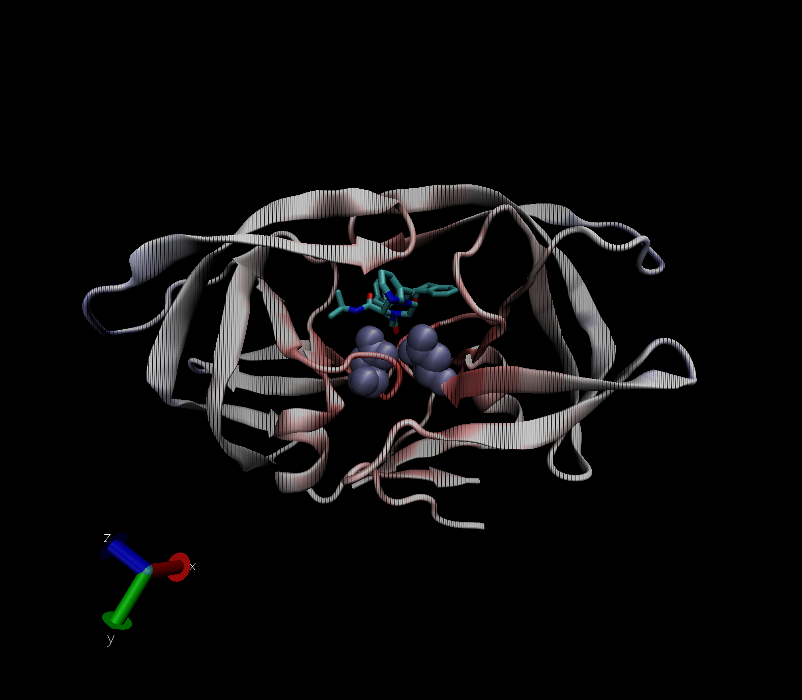

# The PDB Database

```{r}
#load in the summary of the database
PDB_summary <- read.csv("PDB_summary.csv", row.names=1)
PDB_summary
```

> Q1: What percentage of structures in the PDB are solved by X-Ray and
> Electron Microscopy?

```{r}
#Calculate X-ray and EM totals over the entire totals
percent_Xray <- 100*(sum(PDB_summary$X.ray)/sum(PDB_summary$Total))
percent_EM <- 100*(sum(PDB_summary$EM)/sum(PDB_summary$Total))
round(percent_Xray, 2)
round(percent_EM, 2)

#Maybe this is faster with colSums
round(100*(colSums(PDB_summary)/sum(PDB_summary$Total)), 2)
```

> Q2: What proportion of structures in the PDB are protein?

```{r}
#Calculate total protein structures versus all stuctures
prop_prot <- PDB_summary["Protein (only)", "Total"]/sum(PDB_summary$Total)
round(100*prop_prot, 2)

#Again more robust all together
prop_vec <- PDB_summary$Total/sum(PDB_summary$Total)
names(prop_vec)=rownames(PDB_summary)
round(100*prop_vec, 2)
```

> Q3: Type HIV in the PDB website search box on the home page and
> determine how many HIV-1 protease structures are in the current PDB?

There are currently 23409 structures that appear when I search "HIV
protease."

#Examining HIV-1 Protease

Let's view the protease structure with the drug 

> Q4: Water molecules normally have 3 atoms. Why do we see just one atom
> per water molecule in this structure?

The 1.9 angstrom resolution of this structure is not fine enough to view
the small hydrogen atoms.

> Q5: There is a conserved water molecule in the binding site. Can you
> identify this water molecule? What residue number does this water
> molecule have (see note below)?

HOH308:0


# Using Bio3D in R for Structural Bioinformatics

```{r}
library(bio3d)

#The HIV protease structure
pdb <- read.pdb("1hsg")
pdb

#The hel structure
pdb_hel <- read.pdb("1hel")
pdb_hel
pdb_hel$atom
```

```{r}
#Normal mode analysis
m <- nma(pdb_hel)
plot(m)
```

```{r}
#Make a file for VMD to see
mktrj(m, file="nma.pdb")
```

