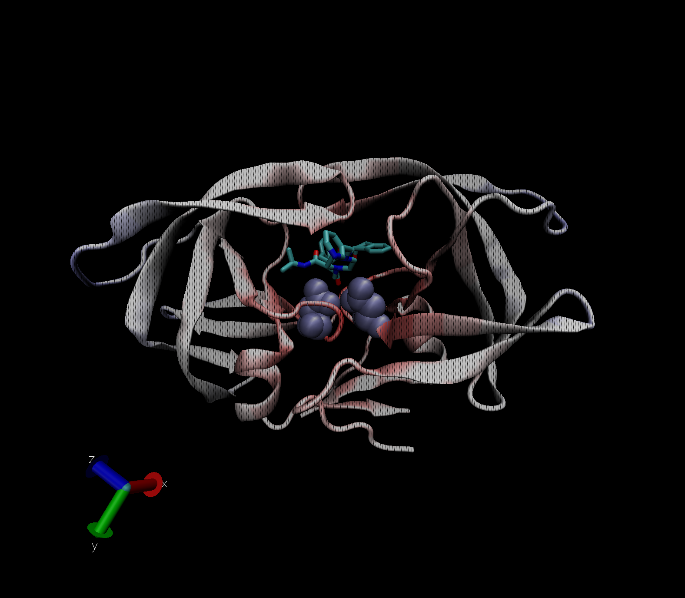

Class 11
================
Pierce Ford (PID: A59010464)

# The PDB Database

``` r
#load in the summary of the database
PDB_summary <- read.csv("PDB_summary.csv", row.names=1)
PDB_summary
```

    ##                          X.ray   NMR   EM Multiple.methods Neutron Other  Total
    ## Protein (only)          142419 11807 6038              177      70    32 160543
    ## Protein/Oligosaccharide   8426    31  991                5       0     0   9453
    ## Protein/NA                7498   274 2000                3       0     0   9775
    ## Nucleic acid (only)       2368  1378   60                8       2     1   3817
    ## Other                      149    31    3                0       0     0    183
    ## Oligosaccharide (only)      11     6    0                1       0     4     22

> Q1: What percentage of structures in the PDB are solved by X-Ray and
> Electron Microscopy?

``` r
#Calculate X-ray and EM totals over the entire totals
percent_Xray <- 100*(sum(PDB_summary$X.ray)/sum(PDB_summary$Total))
percent_EM <- 100*(sum(PDB_summary$EM)/sum(PDB_summary$Total))
round(percent_Xray, 2)
```

    ## [1] 87.53

``` r
round(percent_EM, 2)
```

    ## [1] 4.95

``` r
#Maybe this is faster with colSums
round(100*(colSums(PDB_summary)/sum(PDB_summary$Total)), 2)
```

    ##            X.ray              NMR               EM Multiple.methods 
    ##            87.53             7.36             4.95             0.11 
    ##          Neutron            Other            Total 
    ##             0.04             0.02           100.00

> Q2: What proportion of structures in the PDB are protein?

``` r
#Calculate total protein structures versus all stuctures
prop_prot <- PDB_summary["Protein (only)", "Total"]/sum(PDB_summary$Total)
round(100*prop_prot, 2)
```

    ## [1] 87.35

``` r
#Again more robust all together
prop_vec <- PDB_summary$Total/sum(PDB_summary$Total)
names(prop_vec)=rownames(PDB_summary)
round(100*prop_vec, 2)
```

    ##          Protein (only) Protein/Oligosaccharide              Protein/NA 
    ##                   87.35                    5.14                    5.32 
    ##     Nucleic acid (only)                   Other  Oligosaccharide (only) 
    ##                    2.08                    0.10                    0.01

> Q3: Type HIV in the PDB website search box on the home page and
> determine how many HIV-1 protease structures are in the current PDB?

There are currently 23409 structures that appear when I search “HIV
protease.”

#Examining HIV-1 Protease

Let’s view the protease structure with the drug 

> Q4: Water molecules normally have 3 atoms. Why do we see just one atom
> per water molecule in this structure?

The 1.9 angstrom resolution of this structure is not fine enough to view
the small hydrogen atoms.

> Q5: There is a conserved water molecule in the binding site. Can you
> identify this water molecule? What residue number does this water
> molecule have (see note below)?

OH308:0
