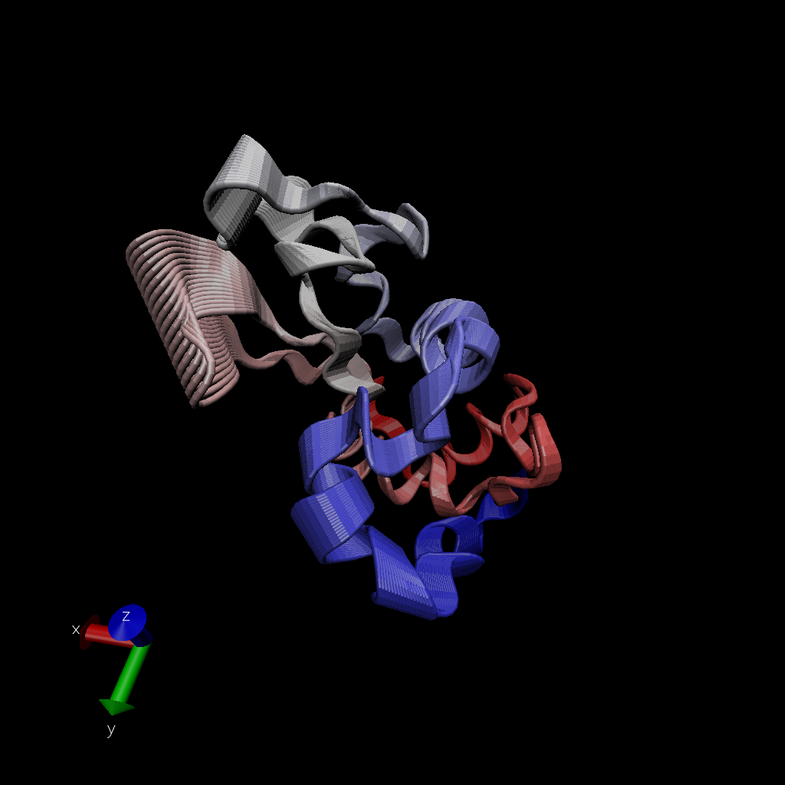
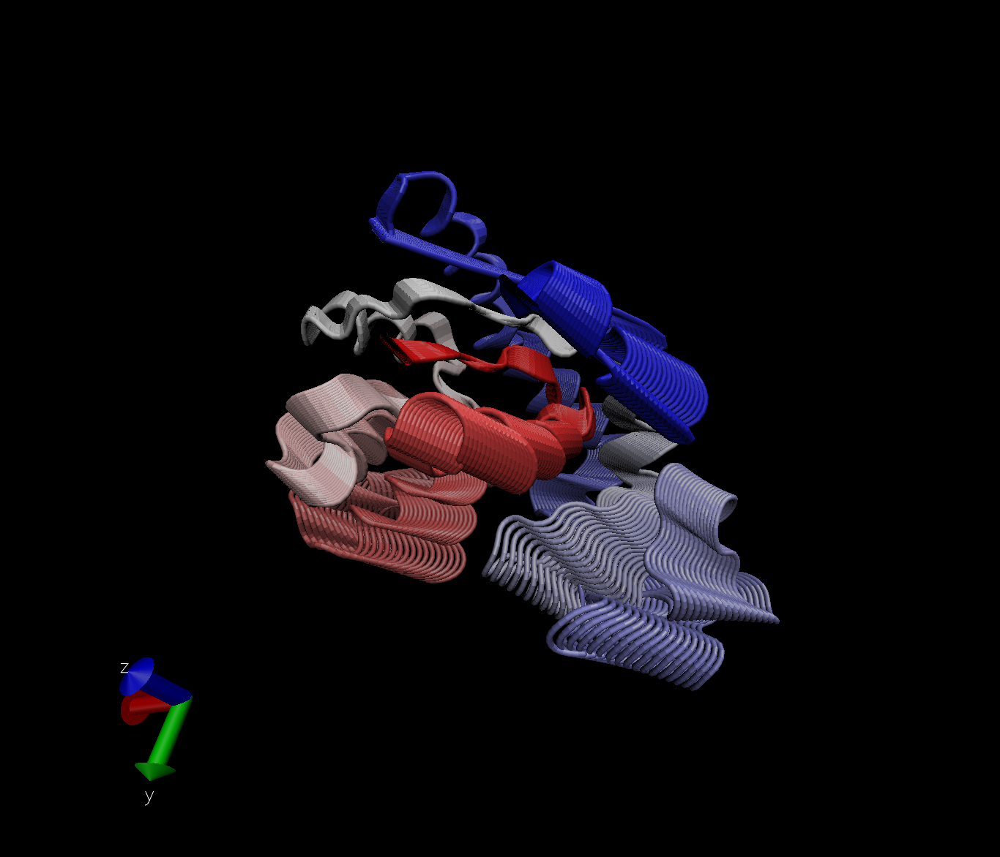

## Protein Dynamics of 1HEL
```{r}
library(bio3d)
pdb <- read.pdb("1hel")
pdb
```

```{r}
head(pdb$atom)
```

Let's do a quick bioinformatics prediction of protein dynamics (flexibility). 
We use the `nma()` function, which does "Normal Mode Analysis."

```{r}
modes <- nma(pdb)
plot(modes)
```

Make a trajectory of this prediction with the `mktrj()`.

```{r}
mktrj(modes, file="nma.pdb")
```

Multi-frame image from VMD


## Comparative Structure Analysis

Start by getting a sequence of interest.

```{r}
aa <- get.seq("1AKE_A")
aa
```

We can use blast in R to find similar proteins.

```{r}
blast <- blast.pdb(aa)
```

And we can plot the results!

```{r}
hits <- plot(blast)
```

We now have top fits from the PDB database.

```{r}
#View IDs of the hits
hits$pdb.id

#Download the hits
files <- get.pdb(hits$pdb.id, path="pdbs", split=TRUE, gzip=TRUE)
```

These files need to be aligned (structurally) for useful comparison. 
We can use the function `pdbaln()`.

```{r}
pdbs <- pdbaln(files, fit = TRUE)
```

```{r}
#View alignment
pdbs
#This aligns coordinates too
pdbs$xyz
```

## Principal Component Analysis

We can do PCA on the xyz coordinate data for the structures with the `pca()` 
function in bio3d.
```{r}
pc <- pca(pdbs)
plot(pc)
```

Much of the variance is captured in PC1. We can make a trajectory to see what 
displacement/movement is encoded by PC1.

```{r}
mktrj(pc, pc=1, file="pca.pdb")
```

Let's see that variation!


Let's save our results.
```{r}
save(blast, hits, pca, pdbs, file="myresults.RData")
#here's how we can load them in the future
load("myresults.RData")
```

