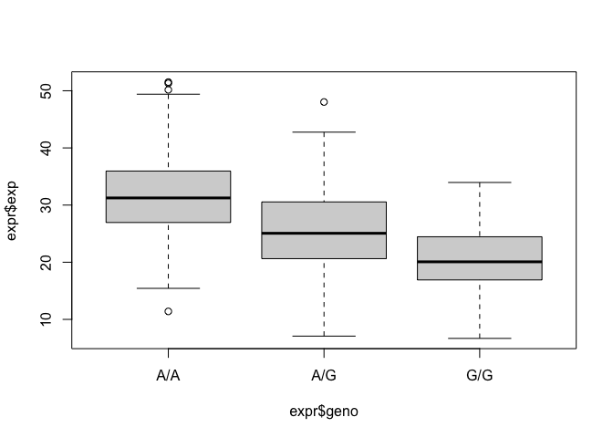
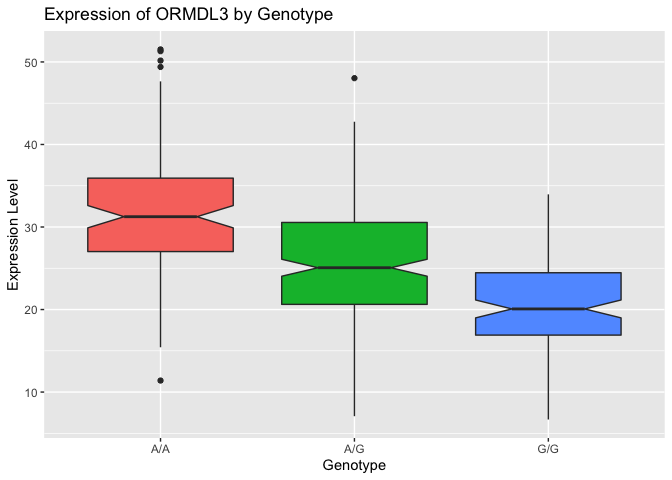

Class 19: RNASeq
================
Pierce Ford (PID: A59010464)
12/5/2021

## Summary of the Goal

One sample is obviously not enough to know what is happening in a
population. You are interested in assessing genetic differences on a
population scale. So, you processed about \~230 samples and did the
normalization on a genome level. Now, you want to find whether there is
any association of the 4 asthma-associated SNPs (rs8067378…) on ORMDL3
expression.

## Q13. Examining the Dataset

> Q13: Read this file into R and determine the sample size for each
> genotype and their corresponding median expression levels for each of
> these genotypes.

``` r
#Read in the data and display the top to check
expr <- read.table("rs8067378_ENSG00000172057.6.txt")
head(expr)
```

    ##    sample geno      exp
    ## 1 HG00367  A/G 28.96038
    ## 2 NA20768  A/G 20.24449
    ## 3 HG00361  A/A 31.32628
    ## 4 HG00135  A/A 34.11169
    ## 5 NA18870  G/G 18.25141
    ## 6 NA11993  A/A 32.89721

``` r
#Determine sample size total
nrow(expr)
```

    ## [1] 462

``` r
#Determine sample size for each genotype
table(expr$geno)
```

    ## 
    ## A/A A/G G/G 
    ## 108 233 121

``` r
#Generate a boxplot object grouped by genotype
base_box <- boxplot(expr$exp ~ expr$geno)
```

<!-- -->

``` r
#Summarize the statisticsof eacg group
summary(base_box$stats)
```

    ##        V1              V2               V3        
    ##  Min.   :15.43   Min.   : 7.075   Min.   : 6.675  
    ##  1st Qu.:26.95   1st Qu.:20.626   1st Qu.:16.903  
    ##  Median :31.25   Median :25.065   Median :20.074  
    ##  Mean   :31.80   Mean   :25.215   Mean   :20.413  
    ##  3rd Qu.:35.96   3rd Qu.:30.552   3rd Qu.:24.457  
    ##  Max.   :49.40   Max.   :42.757   Max.   :33.956

This shows the median expression levels for each genotype. For the A/A
genotype it is 31.25, for the A/G genotype it is 25.065, and for the G/G
genotype it is 20.074.

## Q14. Using ggplot to Make a Cleaner Boxplot

``` r
library(ggplot2)
```

> Q14:Generate a boxplot with a box per genotype, what could you infer
> from the relative expression value between A/A and G/G displayed in
> this plot? Does the SNP effect the expression of ORMDL3?

``` r
#Build a better boxplot
ggplot(expr) + aes(geno, exp, fill=geno) +
  geom_boxplot(notch=TRUE, show.legend=FALSE) +
  xlab("Genotype") + ylab("Expression Level") + ggtitle("Expression of ORMDL3 by Genotype")
```

<!-- -->

Based on this plot, it appears that the “G” variant SNP lowers the
expression of ORMDL3.
