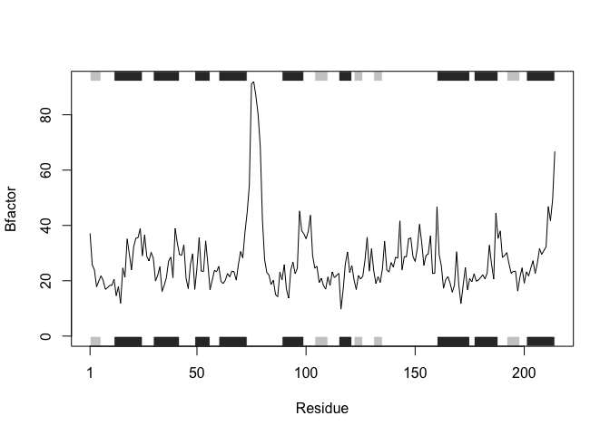
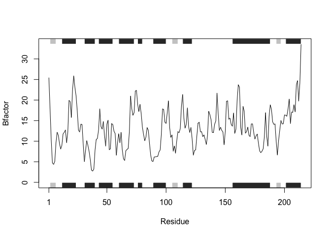
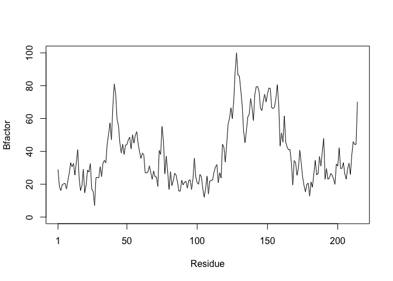
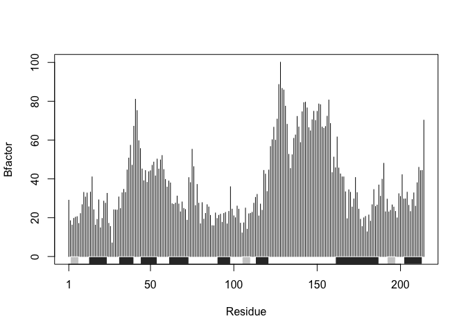
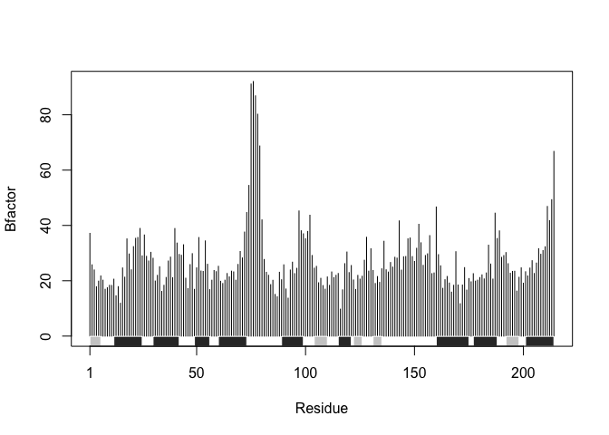
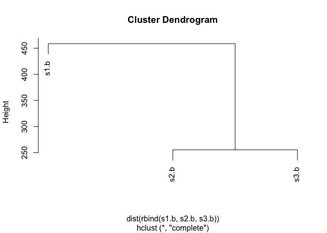
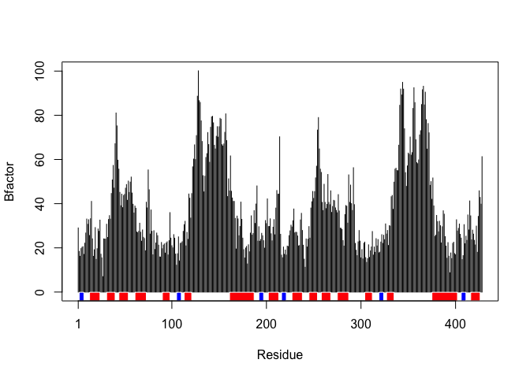
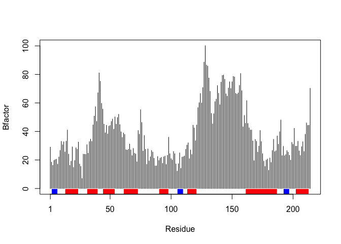

Function Supplement HW
================
Pierce Ford PID:A59010464
10/16/2021

> *Improve this regular R code by abstracting the main activities in
> your own new function. The main steps should entail running through
> the code to see if it works, simplifying to a core working code
> snippet, reducing any calculation duplication, and finally
> transferring your new streamlined code into a more useful function for
> you.*

``` r
#Copy of the raw code, with typos fixed
df <- data.frame(a=1:10, b=seq(200,400,length=10),c=11:20,d=NA)
df$a <- (df$a - min(df$a)) / (max(df$a) - min(df$a))
df$b <- (df$b - min(df$b)) / (max(df$b) - min(df$b))
df$c <- (df$c - min(df$c)) / (max(df$c) - min(df$c))
df$d <- (df$d - min(df$d)) / (max(df$d) - min(df$d))
```

Let’s write a function to normalize vectors like the code above does
manually.

``` r
#Declare function and args
rescale <- function(vec){
  #Call functions inside as minimally as possible
  rng <- range(vec)
  #Rescale the vector
  (vec - rng[1])/(rng[2] - rng[1])
}
```

> *Next improve the below example code for the analysis of protein drug
> interactions by abstracting the main activities in your own new
> function. Then answer questions 1 to 6 below. It is recommended that
> you start a new Project in RStudio in a new directory and then install
> the bio3d package noted in the R code below (N.B. you can use the
> command install.packages(“bio3d”) or the RStudio interface to do
> this).*

> *Then run through the code to see if it works, fix any copy/paste
> errors before simplifying to a core working code snippet, reducing any
> calculation duplication, and finally transferring it into a more
> useful function for you.*

``` r
#Fixed typos in the base code snippet
library(bio3d)
s1 <- read.pdb("4AKE")  # kinase with drug
```

    ##   Note: Accessing on-line PDB file

``` r
s2 <- read.pdb("1AKE")  # kinase no drug
```

    ##   Note: Accessing on-line PDB file
    ##    PDB has ALT records, taking A only, rm.alt=TRUE

``` r
s3 <- read.pdb("1E4Y")  # kinase with drug
```

    ##   Note: Accessing on-line PDB file

``` r
s1.chainA <- trim.pdb(s1, chain="A", elety="CA")
s2.chainA <- trim.pdb(s2, chain="A", elety="CA")
s3.chainA <- trim.pdb(s3, chain="A", elety="CA")
s1.b <- s1.chainA$atom$b
s2.b <- s2.chainA$atom$b
s3.b <- s3.chainA$atom$b
plotb3(s1.b, sse=s1.chainA, typ="l", ylab="Bfactor")
```

<!-- -->

``` r
plotb3(s2.b, sse=s2.chainA, typ="l", ylab="Bfactor")
```

<!-- -->

``` r
plotb3(s3.b, sse=s3.chainA, typ="l", ylab="Bfactor")
```

<!-- -->

## Q1.What type of object is returned from the read.pdb() function?

``` r
#The function returns a "large pdb" object, that contains the data seen in the 
#example below and addition attributes that can be called
s1
```

    ## 
    ##  Call:  read.pdb(file = "4AKE")
    ## 
    ##    Total Models#: 1
    ##      Total Atoms#: 3459,  XYZs#: 10377  Chains#: 2  (values: A B)
    ## 
    ##      Protein Atoms#: 3312  (residues/Calpha atoms#: 428)
    ##      Nucleic acid Atoms#: 0  (residues/phosphate atoms#: 0)
    ## 
    ##      Non-protein/nucleic Atoms#: 147  (residues: 147)
    ##      Non-protein/nucleic resid values: [ HOH (147) ]
    ## 
    ##    Protein sequence:
    ##       MRIILLGAPGAGKGTQAQFIMEKYGIPQISTGDMLRAAVKSGSELGKQAKDIMDAGKLVT
    ##       DELVIALVKERIAQEDCRNGFLLDGFPRTIPQADAMKEAGINVDYVLEFDVPDELIVDRI
    ##       VGRRVHAPSGRVYHVKFNPPKVEGKDDVTGEELTTRKDDQEETVRKRLVEYHQMTAPLIG
    ##       YYSKEAEAGNTKYAKVDGTKPVAEVRADLEKILGMRIILLGAPGA...<cut>...KILG
    ## 
    ## + attr: atom, xyz, seqres, helix, sheet,
    ##         calpha, remark, call

## Q2. What does the trim.pdb() function do?

``` r
#The trim.pdb() function creates a smaller pdb object from a larger one by 
#specifying a particular chain, see trimmed s1 below
s1.chainA
```

    ## 
    ##  Call:  trim.pdb(pdb = s1, chain = "A", elety = "CA")
    ## 
    ##    Total Models#: 1
    ##      Total Atoms#: 214,  XYZs#: 642  Chains#: 1  (values: A)
    ## 
    ##      Protein Atoms#: 214  (residues/Calpha atoms#: 214)
    ##      Nucleic acid Atoms#: 0  (residues/phosphate atoms#: 0)
    ## 
    ##      Non-protein/nucleic Atoms#: 0  (residues: 0)
    ##      Non-protein/nucleic resid values: [ none ]
    ## 
    ##    Protein sequence:
    ##       MRIILLGAPGAGKGTQAQFIMEKYGIPQISTGDMLRAAVKSGSELGKQAKDIMDAGKLVT
    ##       DELVIALVKERIAQEDCRNGFLLDGFPRTIPQADAMKEAGINVDYVLEFDVPDELIVDRI
    ##       VGRRVHAPSGRVYHVKFNPPKVEGKDDVTGEELTTRKDDQEETVRKRLVEYHQMTAPLIG
    ##       YYSKEAEAGNTKYAKVDGTKPVAEVRADLEKILG
    ## 
    ## + attr: atom, helix, sheet, seqres, xyz,
    ##         calpha, call

## Q3. What input parameter would turn off the marginal black and grey rectangles in the plots and what do they represent in this case?

``` r
#The marginal black and grey rectangles represent secondary structure elements 
#(helixes and sheets) of the protein they can be removed by setting top and 
#bottom to false
plotb3(s1.b, sse=s1.chainA, typ="l", ylab="Bfactor", top=FALSE, bot=FALSE)
```

<!-- -->

## Q4. What would be a better plot to compare across the different proteins?

``` r
#I think the histogram option is easier to compare between proteins than the 
#line or point options
plotb3(s1.b, sse=s1.chainA, typ="h", ylab="Bfactor", top=FALSE)
```

<!-- -->

``` r
plotb3(s2.b, sse=s2.chainA, typ="h", ylab="Bfactor", top=FALSE)
```

<!-- -->

## Q5. Which proteins are more similar to each other in their B-factor trends. How could you quantify this?

``` r
#The total difference between the proteins' B-factors can be quantified by 
#taking the distance between the B-factor vectors, which can then be visualized 
#in a dendrogram plot

#Code for how to visualize the difference in B-factors
hc <- hclust(dist(rbind(s1.b, s2.b, s3.b)))
plot(hc)
```

<!-- -->

## Q6. How would you generalize the original code above to work with any set of input protein structures?

> *Write your own function starting from the code above that analyzes
> protein drug interactions by reading in any protein PDB data and
> outputs a plot for the specified protein.*

> *Create a new RMarkdown document with your function code AND example
> output. We also suggest you include narrative text that address the
> rubric items below. Generate a PDF report and submit this PDF to our
> GradeScope site.*

Let’s write a function that takes PDB data and plots the B-factors.

``` r
#Function PlotPdb takes a PDB name as a string as input and an optional chain 
#string for trimming if needed
PlotPdb <- function(PDB, chn=NULL){
  
  #read in the PDB data
  prot <- read.pdb(PDB)
  
  #trim the protein to focus on C alpha atoms (also focus on particular chain 
  #if specified)
  prot <- trim.pdb(prot, chain=chn, elety="CA")
  
  #save and plot the b values in a histogram with secondary structure boxes at 
  #the bottom (red for helices, blue for sheets)
  prot.b <- prot$atom$b
  plotb3(prot.b, sse=prot, typ="h", ylab="Bfactor", top=FALSE, helix.col="red", sheet.col="blue")
}

#Test function with one of the examples used previously
PlotPdb("4AKE")
```

    ##   Note: Accessing on-line PDB file

    ## Warning in get.pdb(file, path = tempdir(), verbose = FALSE): /var/folders/1z/
    ## wnlv45xj0jv026tvnj94cp300000gp/T//RtmpuYFfg8/4AKE.pdb exists. Skipping download

<!-- -->

``` r
PlotPdb("4AKE", chn="A")
```

    ##   Note: Accessing on-line PDB file

    ## Warning in get.pdb(file, path = tempdir(), verbose = FALSE): /var/folders/1z/
    ## wnlv45xj0jv026tvnj94cp300000gp/T//RtmpuYFfg8/4AKE.pdb exists. Skipping download

<!-- -->
