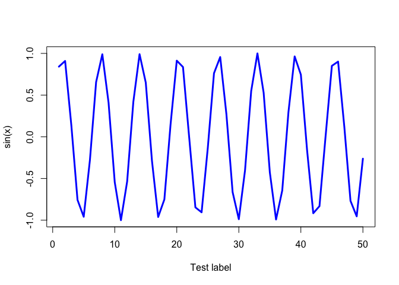

R Language Basics
================
Pierce Ford (PID: A59010464)
2021-12-05

``` r
# Example for week 3
x <- 1:50

x
```

    ##  [1]  1  2  3  4  5  6  7  8  9 10 11 12 13 14 15 16 17 18 19 20 21 22 23 24 25
    ## [26] 26 27 28 29 30 31 32 33 34 35 36 37 38 39 40 41 42 43 44 45 46 47 48 49 50

``` r
plot(x, sin(x))
```

<!-- -->

``` r
plot(x, sin(x), type="l", col="blue", lwd=3, xlab="Test label")
```

<!-- -->
